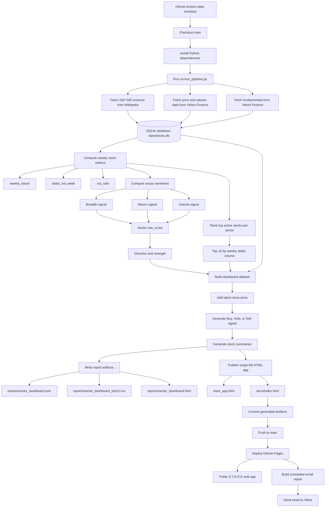

# Sector & Stock Trend Analysis Engine (S.T.A.R.E)

Sector & Stock Trend Analysis Engine (S.T.A.R.E) is an automated analytics pipeline and single-file HTML dashboard for monitoring S&P 500 sector momentum, active stocks, and basic company fundamentals.

It collects public market data, stores it in SQLite, calculates weekly stock and sector signals, and publishes a static GitHub Pages application that can be accessed from anywhere.

Author: Viktor Kvapil

## What S.T.A.R.E Does

S.T.A.R.E answers a practical market-monitoring question:

Which S&P 500 sectors are showing the strongest short-term trend, and which stocks are driving that activity?

The project turns raw market data into a publishable dashboard with:

- Sector sentiment direction: Bullish, Bearish, or Neutral
- Sector sentiment strength from 0 to 100
- Top active stocks per sector by weekly dollar volume
- Latest available close price for every displayed stock
- Weekly stock returns
- Volume activity versus recent baseline
- Company fundamentals such as market cap, P/E, margins, dividend yield, beta, industry, exchange, and currency
- Deterministic Buy, Hold, or Sell model signals for every displayed stock
- A static HTML app that works without a backend

The output is intended for screening, monitoring, and research. It is not financial advice.

## Published App

The publishable app is generated as:

- `stare_app.html` - standalone root-level HTML app
- `docs/index.html` - GitHub Pages entry point

When deployed through GitHub Pages, the expected public URL is:

`https://vittok.github.io/stare/`

The app embeds the latest dashboard JSON directly into the HTML file, so it can be served as a single static page. No server, database, API, or JavaScript package runtime is needed by the published page.

During publishing, the embedded data is sanitized into strict browser-safe JSON. Missing or non-finite values such as `NaN`, `Infinity`, and `-Infinity` are converted to `null` so the app can reliably parse and render the data in any browser.

## Data Sources

STARE uses public data sources:

- S&P 500 universe: Wikipedia list of S&P 500 companies
- Historical prices and volumes: Yahoo Finance through `yfinance`
- Fundamentals: Yahoo Finance through `yfinance`

The universe file is written to `data/universe_sp500.csv`. Market data and computed results are stored in `data/stocks.db`.

## Pipeline Overview

The main pipeline is run with:

```bash
python src/run_pipeline.py
```

Pipeline steps:

1. `src/universe_sp500.py`
   Fetches the current S&P 500 company list, normalizes ticker symbols for Yahoo Finance, and stores sector and sub-industry metadata.

2. `src/fetch_prices.py`
   Downloads recent daily OHLCV price data in chunks and upserts it into SQLite.

3. `src/compute_weekly_stats.py`
   Calculates latest 5-session stock-level metrics.

4. `src/compute_sector_sentiment.py`
   Converts the latest available weekly stock behavior into sector-level sentiment.

5. `src/rank_sector_top_active.py`
   Ranks the most active stocks inside each sector by weekly dollar volume for the latest available `week_ending`.

6. `src/build_sector_dashboard.py`
   Joins sector sentiment, top active stocks, recent return data, latest available close prices, and fundamentals into dashboard JSON/CSV outputs.

7. `src/build_sector_dashboard_html.py`
   Builds the legacy HTML report.

8. `src/publish_stare_app.py`
   Embeds fresh dashboard data, refresh metadata, generated top-3 stock summaries, and Buy/Hold/Sell model signals into the standalone HTML app and publishes it to `docs/index.html`.

## Application Workflow



## What Gets Calculated

### Weekly Stock Metrics

For each ticker, STARE looks at the latest 5 available trading sessions.

`weekly_return`

The percentage return from the first close in the 5-session window to the last close:

```text
weekly_return = last_close / first_close - 1
```

`dollar_vol_week`

The total traded dollar volume over the 5-session window:

```text
dollar_vol_week = sum(close * volume)
```

`week_volume`

The total share volume over the same 5-session window:

```text
week_volume = sum(volume)
```

`vol_ratio`

The current 5-session share volume divided by the average weekly volume across the prior 8 weeks:

```text
vol_ratio = current_week_volume / average_prior_8_week_volume
```

This highlights whether a stock is trading with unusually high or low activity.

### Sector Sentiment

Sector sentiment combines three signals:

`breadth_signal`

How many stocks in the sector had a positive weekly return:

```text
breadth = positive_return_stock_count / sector_stock_count
breadth_signal = (breadth - 0.5) * 2
```

A sector where most stocks are rising receives a positive breadth signal. A sector where most stocks are falling receives a negative signal.

`return_signal`

The sector's median weekly stock return, scaled around a 3% weekly move:

```text
return_signal = median_weekly_return / 0.03
```

The result is capped between `-1.0` and `1.0`.

`volume_signal`

The sector's median volume ratio, scaled around a 50% increase over baseline:

```text
volume_signal = (median_vol_ratio - 1.0) / 0.5
```

The result is capped between `-1.0` and `1.0`.

`raw_score`

The final sector score is a weighted blend:

```text
raw_score = 0.50 * breadth_signal
          + 0.35 * return_signal
          + 0.15 * volume_signal
```

This means breadth matters most, median return matters second, and abnormal volume acts as confirmation.

`direction`

The raw score is converted into a readable direction:

```text
abs(raw_score) < 0.05 -> Neutral
raw_score > 0         -> Bullish
raw_score < 0         -> Bearish
```

`strength`

The strength value converts the absolute raw score into a 0-100 scale:

```text
strength = min(100, abs(raw_score) * 100)
```

### Top Active Stocks

For each sector, stocks are ranked by `dollar_vol_week`.

This identifies the names with the largest amount of money traded during the weekly window. It helps separate broad sector direction from the individual stocks that are carrying the most market activity.

### Displayed Stock Prices

For each stock shown in the dashboard, S.T.A.R.E pulls the latest close price already stored in the `prices` table at or before the current dashboard `week_ending`.

The app displays this as `currentPrice` beside the ticker symbol and stores the source trading date as `priceDate`. This keeps the published app static while still showing the most recent price captured during the scheduled data refresh.

S.T.A.R.E also stores the prior trading-session close as `previousClose` with `previousCloseDate`. The app compares `currentPrice` against `previousClose` and displays the day-over-day close direction:

- Green up marker when the latest close is higher
- Black neutral marker when the latest close is unchanged
- Red down marker when the latest close is lower

The page header shows both the app refresh timestamp and the market data date, so users can distinguish when the static app was regenerated from the trading date behind the displayed prices.

### Fundamentals

STARE stores normalized fundamentals in `fundamentals_latest`, including:

- Market capitalization
- Enterprise value
- Trailing and forward P/E
- Price-to-book
- Profit, operating, and gross margins
- Return on equity and assets
- Revenue and earnings growth
- Debt and liquidity ratios
- Dividend yield and payout ratio
- Beta
- 52-week range
- Sector, industry, country, exchange, and currency

Fundamentals are used to add business context to the active stock rankings.

### Daily Stock Summaries

During each publish step, S.T.A.R.E selects the top 3 active stocks in each sector and generates short explanatory summaries from the fundamentals available in the dashboard data.

The summaries focus on:

- Price-to-book (P/B)
- Price-to-earnings (P/E)
- Price/earnings-to-growth (PEG), when available
- Dividend yield

These summaries are embedded into the HTML and shown when hovering over or clicking ticker symbols in the app table.

### Buy, Hold, or Sell Signals

During publishing, S.T.A.R.E also generates a deterministic model signal for every displayed stock:

- `Buy`
- `Hold`
- `Sell`

The signal combines sector market sentiment with stock-level weekly momentum and selected fundamentals:

- Price-to-book (P/B)
- Price-to-earnings (P/E)
- Price/earnings-to-growth (PEG), when available
- Dividend yield

Bullish sector sentiment, positive weekly return, lower valuation ratios, reasonable PEG, and higher dividend yield add support to the score. Bearish sector sentiment, negative weekly return, elevated valuation ratios, and weak or missing growth/value support reduce the score.

The output includes a recommendation action, confidence score, and short rationale. These signals are research-oriented model outputs for screening and monitoring only; they are not personalized financial advice.

## Value Added

Raw stock tables are noisy. STARE adds value by organizing the data into a repeatable market overview:

- It compresses hundreds of S&P 500 tickers into sector-level signals.
- It shows whether a sector move is broad-based or concentrated.
- It combines price direction with volume confirmation.
- It surfaces the most liquid and active names in each sector.
- It shows the latest captured close price next to each displayed stock.
- It adds fundamentals so activity can be interpreted with company context.
- It turns sector sentiment and fundamentals into plain Buy/Hold/Sell screening signals.
- It produces static outputs that are easy to publish, archive, inspect, and share.

The dashboard is especially useful as a daily pre-market or morning scan: it points attention toward sectors with broad momentum and toward stocks where activity is highest.

## Automation

The GitHub Actions workflow in `.github/workflows/pipeline_weekdays.yml` refreshes around the regular US market open and close:

```text
09:35 America/New_York - market open refresh
16:10 America/New_York - market close refresh
```

GitHub Actions schedules are defined in UTC/GMT, so the workflow includes paired UTC cron entries for daylight saving time and standard time. A guard step checks which cron expression triggered the run and only lets the active New York-time pair proceed, even if GitHub starts the scheduled job late.

On each scheduled market refresh, it:

1. Checks out `main`
2. Pulls the latest `origin/main` with `git pull --ff-only origin main`
3. Installs Python dependencies
4. Runs the market-data pipeline
5. Regenerates dashboard reports
6. Embeds the latest JSON data, displayed prices, stock summaries, and model signals into the HTML app
7. Pulls `origin/main` again before committing generated artifacts
8. Commits updated artifacts back to the repository
9. Deploys `docs/` to GitHub Pages
10. Sends the updated report by email to `vittok@hotmail.com`

Fundamentals are refreshed weekly after the Monday market close to reduce load.

### Scheduled Email Report

The scheduled workflow sends an HTML email report after GitHub Pages deployment. The email body is generated from the freshly embedded `stare_app.html` data and includes:

- Last refresh timestamp
- Link to the published S.T.A.R.E dashboard
- Sector overview table
- Top active stock summaries
- Updated stock report with ticker, price, signal, confidence, weekly return, and dollar volume

GitHub Actions does not include email credentials by default, so the repository must define SMTP secrets before email delivery can work:

- `SMTP_HOST` - SMTP server host
- `SMTP_PORT` - SMTP server port, usually `587`
- `SMTP_USERNAME` - SMTP account username
- `SMTP_PASSWORD` - SMTP password or app password
- `SMTP_FROM` - sender email address; optional if the username is also the sender
- `SMTP_STARTTLS` - optional; defaults to `true`
- `SMTP_SSL` - optional; defaults to `false`

If the required SMTP secrets are missing, the workflow logs a warning and skips only the email step.

The workflow can also be triggered manually from the GitHub Actions tab.

## Repository Structure

```text
.
├── data/
│   ├── stocks.db
│   └── universe_sp500.csv
├── docs/
│   ├── index.html
│   ├── sector_dashboard.json
│   └── sector_dashboard_top10.csv
├── reports/
│   ├── sector_dashboard.html
│   ├── sector_dashboard.json
│   ├── sector_dashboard_top10.csv
│   └── fundamentals_sp500_latest.csv
├── src/
│   ├── build_sector_dashboard.py
│   ├── build_sector_dashboard_html.py
│   ├── compute_sector_sentiment.py
│   ├── compute_weekly_stats.py
│   ├── fetch_fundamentals.py
│   ├── fetch_prices.py
│   ├── publish_stare_app.py
│   ├── rank_sector_top_active.py
│   ├── run_pipeline.py
│   ├── store_sqlite.py
│   └── universe_sp500.py
├── stare_app.html
├── requirements.txt
└── README.md
```

## Database Tables

Core SQLite tables:

- `prices`
- `weekly_stats`
- `sector_sentiment`
- `sector_top_active`
- `fundamentals_snapshot`
- `fundamentals_latest`
- `sector_dashboard_top10`

See `DATA_SCHEMA.md` for a compact schema summary.

## Local Setup

Recommended Python version:

```text
3.11.7
```

Install dependencies:

```bash
python -m pip install --upgrade pip
pip install -r requirements.txt
```

Run the full pipeline:

```bash
python src/run_pipeline.py
```

Refresh only the publishable app from existing report data:

```bash
python src/publish_stare_app.py
```

Open the local app:

```text
stare_app.html
```

## Outputs

Primary generated outputs:

- `reports/sector_dashboard.json` - nested dashboard data
- `reports/sector_dashboard_top10.csv` - flat top-active table
- `reports/sector_dashboard.html` - legacy report HTML
- `stare_app.html` - standalone publishable app
- `docs/index.html` - GitHub Pages app

## Design Principles

- SQLite-first storage
- Deterministic calculations from stored data
- Static publishing
- No backend required for the published app
- CI-friendly automation
- Human-readable outputs for inspection and sharing

## License

MIT
